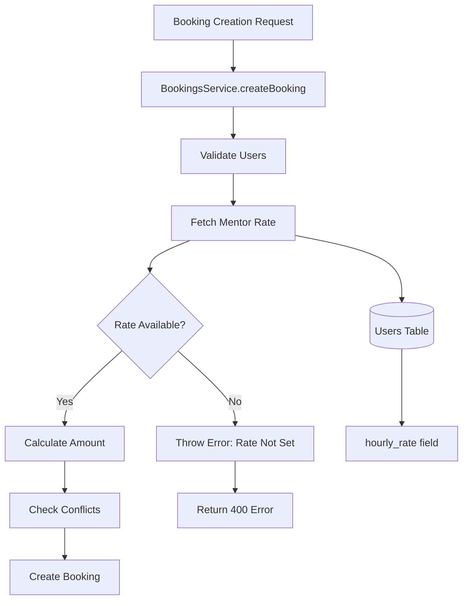
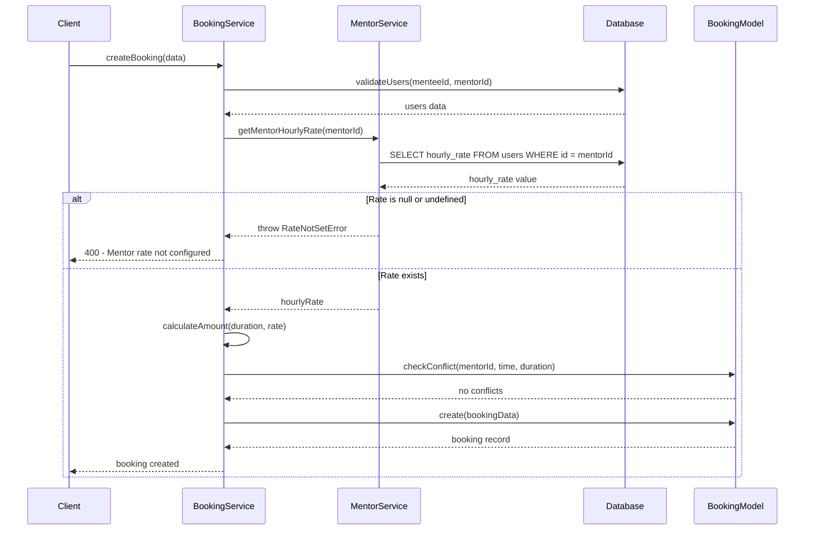

# Design Document: Dynamic Hourly Rate Fetching

## Overview

Replace the hardcoded $50 hourly rate in the booking system with dynamic fetching from mentor profiles. This enhancement enables mentor-specific pricing by retrieving the `hourly_rate` field from the mentor's profile in the database, calculating booking costs based on the fetched rate, and preventing booking creation when mentors haven't configured their rates.

## Architecture



## Sequence Diagrams

### Main Booking Flow with Dynamic Rate



## Components and Interfaces

### MentorService Enhancement

**Purpose**: Provide mentor-specific data including hourly rates

**Interface**:
```typescript
interface MentorService {
  getMentorHourlyRate(mentorId: string): Promise<number>
  validateMentorRateExists(mentorId: string): Promise<void>
}
```

**Responsibilities**:
- Fetch mentor hourly rate from database
- Validate rate exists and is positive
- Handle rate not set scenarios

### BookingService Enhancement

**Purpose**: Enhanced booking creation with dynamic rate calculation

**Interface**:
```typescript
interface BookingService {
  createBooking(data: CreateBookingData): Promise<BookingRecord>
  calculateBookingAmount(durationMinutes: number, hourlyRate: number): string
}
```

**Responsibilities**:
- Fetch mentor rate before amount calculation
- Calculate booking amount using dynamic rate
- Handle rate validation errors

## Data Models

### Mentor Rate Data

```typescript
interface MentorRateData {
  mentorId: string
  hourlyRate: number | null
  currency: string
  lastUpdated: Date
}
```

**Validation Rules**:
- hourlyRate must be positive number or null
- currency must be valid currency code
- mentorId must reference existing mentor user

### Enhanced Booking Data

```typescript
interface CreateBookingData {
  menteeId: string
  mentorId: string
  scheduledAt: Date
  durationMinutes: number
  topic: string
  notes?: string
}

interface BookingCalculation {
  hourlyRate: number
  durationMinutes: number
  amount: string
  currency: string
}
```

## Algorithmic Pseudocode

### Main Rate Fetching Algorithm

```typescript
ALGORITHM fetchMentorHourlyRate(mentorId)
INPUT: mentorId of type string
OUTPUT: hourlyRate of type number

BEGIN
  ASSERT mentorId is non-empty string
  
  // Step 1: Query mentor rate from database
  query ← "SELECT hourly_rate FROM users WHERE id = $1 AND role = 'mentor' AND is_active = true"
  result ← database.query(query, [mentorId])
  
  // Step 2: Validate query result
  IF result.rows.length = 0 THEN
    THROW MentorNotFoundError("Mentor not found or inactive")
  END IF
  
  rate ← result.rows[0].hourly_rate
  
  // Step 3: Validate rate exists and is positive
  IF rate IS NULL OR rate IS UNDEFINED THEN
    THROW RateNotSetError("Mentor has not configured hourly rate")
  END IF
  
  IF rate <= 0 THEN
    THROW InvalidRateError("Mentor hourly rate must be positive")
  END IF
  
  ASSERT rate > 0
  
  RETURN rate
END
```

**Preconditions:**
- mentorId is valid UUID string
- Database connection is available
- Users table exists with hourly_rate column

**Postconditions:**
- Returns positive number representing hourly rate
- Throws specific error if rate not available
- No side effects on database state

**Loop Invariants:** N/A (no loops in this algorithm)

### Booking Amount Calculation Algorithm

```typescript
ALGORITHM calculateBookingAmount(durationMinutes, hourlyRate)
INPUT: durationMinutes of type number, hourlyRate of type number
OUTPUT: amount of type string (decimal with 7 precision)

BEGIN
  ASSERT durationMinutes > 0 AND durationMinutes <= 240
  ASSERT hourlyRate > 0
  
  // Step 1: Convert duration to hours
  durationHours ← durationMinutes / 60
  
  // Step 2: Calculate raw amount
  rawAmount ← durationHours * hourlyRate
  
  // Step 3: Format to 7 decimal places for Stellar precision
  amount ← rawAmount.toFixed(7)
  
  ASSERT parseFloat(amount) > 0
  
  RETURN amount
END
```

**Preconditions:**
- durationMinutes is positive integer between 15 and 240
- hourlyRate is positive number
- Both parameters are valid numbers

**Postconditions:**
- Returns string representation of amount with 7 decimal precision
- Amount is positive and properly formatted for Stellar transactions
- No rounding errors that could cause payment issues

**Loop Invariants:** N/A (no loops in this algorithm)

## Key Functions with Formal Specifications

### Function 1: getMentorHourlyRate()

```typescript
async function getMentorHourlyRate(mentorId: string): Promise<number>
```

**Preconditions:**
- `mentorId` is non-empty string in UUID format
- Database connection is established
- Users table exists and is accessible

**Postconditions:**
- Returns positive number representing mentor's hourly rate
- Throws `MentorNotFoundError` if mentor doesn't exist or is inactive
- Throws `RateNotSetError` if mentor hasn't configured rate
- Throws `InvalidRateError` if rate is not positive
- No database state changes

**Loop Invariants:** N/A (single database query, no loops)

### Function 2: validateMentorRateExists()

```typescript
async function validateMentorRateExists(mentorId: string): Promise<void>
```

**Preconditions:**
- `mentorId` is non-empty string in UUID format
- Database connection is established

**Postconditions:**
- Returns void if mentor rate exists and is valid
- Throws appropriate error if validation fails
- No database state changes
- Function is idempotent

**Loop Invariants:** N/A (validation function, no loops)

### Function 3: calculateBookingAmount()

```typescript
function calculateBookingAmount(durationMinutes: number, hourlyRate: number): string
```

**Preconditions:**
- `durationMinutes` is integer between 15 and 240 (inclusive)
- `hourlyRate` is positive number
- Both parameters are finite numbers

**Postconditions:**
- Returns string with exactly 7 decimal places
- Result represents positive monetary amount
- Calculation is mathematically accurate within floating-point precision
- Result is suitable for Stellar blockchain transactions

**Loop Invariants:** N/A (pure calculation function, no loops)

## Example Usage

```typescript
// Example 1: Successful booking creation with dynamic rate
const bookingData = {
  menteeId: "mentee-uuid-123",
  mentorId: "mentor-uuid-456", 
  scheduledAt: new Date("2026-03-25T14:00:00Z"),
  durationMinutes: 60,
  topic: "Career guidance"
}

try {
  const booking = await BookingsService.createBooking(bookingData)
  console.log(`Booking created with amount: ${booking.amount}`)
} catch (error) {
  if (error instanceof RateNotSetError) {
    console.log("Mentor needs to set hourly rate first")
  }
}

// Example 2: Rate fetching and validation
try {
  const rate = await MentorService.getMentorHourlyRate("mentor-uuid-456")
  const amount = calculateBookingAmount(90, rate) // 1.5 hour session
  console.log(`90-minute session cost: ${amount} XLM`)
} catch (error) {
  console.error("Rate fetching failed:", error.message)
}

// Example 3: Mentor rate validation before booking
async function createBookingWithValidation(data: CreateBookingData) {
  // Pre-validate mentor rate exists
  await MentorService.validateMentorRateExists(data.mentorId)
  
  // Proceed with booking creation
  return await BookingsService.createBooking(data)
}
```

## Correctness Properties

### Universal Quantification Statements

1. **Rate Existence Property**: ∀ booking ∈ Bookings, ∃ rate ∈ ℝ⁺ such that booking.mentor has configured rate
2. **Amount Calculation Property**: ∀ (duration, rate) ∈ ℕ⁺ × ℝ⁺, calculateAmount(duration, rate) = (duration/60) × rate
3. **Error Handling Property**: ∀ mentorId where mentor.hourly_rate = null, getMentorHourlyRate(mentorId) throws RateNotSetError
4. **Precision Property**: ∀ calculated amounts, amount string has exactly 7 decimal places
5. **Positive Amount Property**: ∀ valid inputs, calculated amount > 0

### Invariants

1. **Database Consistency**: mentor.hourly_rate ≥ 0 OR mentor.hourly_rate IS NULL
2. **Booking Amount Consistency**: booking.amount = (booking.duration_minutes / 60) × mentor.hourly_rate
3. **Error State Consistency**: If RateNotSetError thrown, no booking record created
4. **Precision Consistency**: All monetary amounts maintain 7 decimal precision

## Error Handling

### Error Scenario 1: Mentor Rate Not Set

**Condition**: Mentor exists but hourly_rate field is null
**Response**: Throw RateNotSetError with descriptive message
**Recovery**: Mentor must set rate via profile update API before bookings allowed

### Error Scenario 2: Mentor Not Found

**Condition**: mentorId doesn't exist or mentor is inactive
**Response**: Throw MentorNotFoundError 
**Recovery**: Verify mentor ID and ensure mentor account is active

### Error Scenario 3: Invalid Rate Value

**Condition**: hourly_rate exists but is zero or negative
**Response**: Throw InvalidRateError
**Recovery**: Mentor must update rate to positive value

### Error Scenario 4: Database Connection Failure

**Condition**: Database query fails due to connection issues
**Response**: Throw DatabaseError with retry suggestion
**Recovery**: Retry request after brief delay, escalate if persistent

## Testing Strategy

### Unit Testing Approach

Test individual functions in isolation with comprehensive input validation, error scenarios, and edge cases. Focus on rate fetching logic, amount calculations, and error handling paths.

**Key Test Cases**:
- Valid rate fetching with various rate values
- Null/undefined rate handling
- Invalid mentor ID scenarios
- Amount calculation precision
- Error message accuracy

**Property Test Library**: fast-check for TypeScript

### Property-Based Testing Approach

Generate random valid inputs to verify mathematical properties and invariants hold across all possible input combinations.

**Properties to Test**:
- Amount calculation is always positive for valid inputs
- Rate fetching is idempotent (same result on repeated calls)
- Error types are consistent for same error conditions
- Precision is maintained across all calculations

### Integration Testing Approach

Test the complete booking flow with database interactions, ensuring rate fetching integrates properly with existing booking creation process.

**Integration Scenarios**:
- End-to-end booking creation with various mentor rates
- Database transaction rollback on rate validation failure
- Concurrent booking attempts with rate fetching
- Performance under load with rate queries

## Performance Considerations

**Database Query Optimization**: Add index on (id, role, is_active) for efficient mentor lookups. Consider caching frequently accessed mentor rates with 5-minute TTL to reduce database load.

**Caching Strategy**: Implement Redis caching for mentor rates with cache invalidation on rate updates. Cache key format: `mentor:rate:{mentorId}` with automatic expiration.

**Query Batching**: For bulk operations, batch mentor rate queries to reduce database round trips. Use single query with IN clause for multiple mentor IDs.

## Security Considerations

**Input Validation**: Validate all mentor IDs are proper UUIDs to prevent injection attacks. Sanitize and validate rate values to prevent manipulation.

**Authorization**: Ensure only authenticated users can trigger rate fetching. Verify mentee has permission to book with specific mentor.

**Rate Tampering Prevention**: Fetch rates directly from database at booking time, never trust client-provided rates. Log all rate fetching attempts for audit trails.

## Dependencies

**Database**: PostgreSQL with existing users table and hourly_rate column
**ORM/Query Builder**: Existing database pool and query infrastructure  
**Error Handling**: Custom error classes (RateNotSetError, MentorNotFoundError, InvalidRateError)
**Logging**: Existing logger utility for audit and debugging
**Validation**: Input validation for mentor IDs and rate values
**Caching** (Optional): Redis for rate caching if performance optimization needed