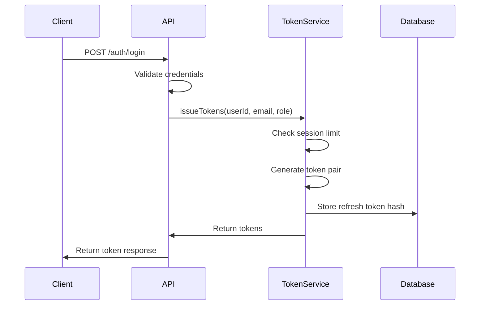
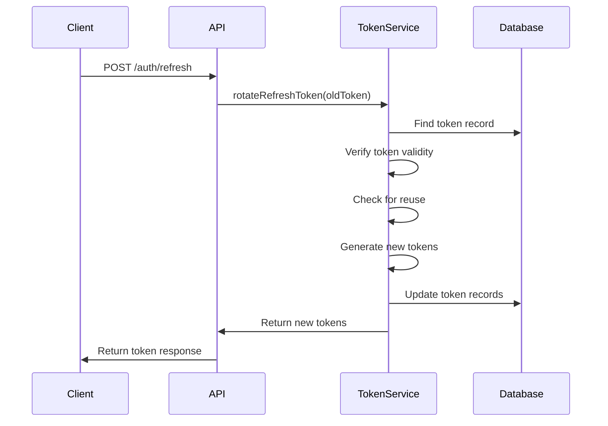
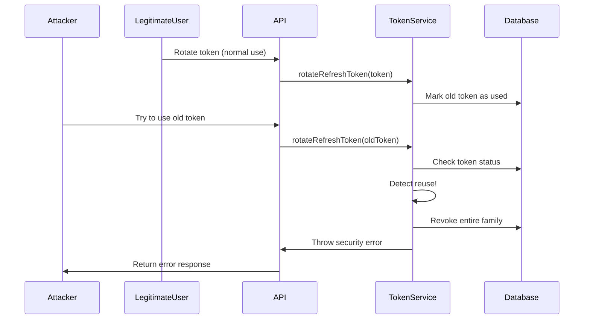

# Token Lifecycle Guide

## Overview

This guide provides a comprehensive walkthrough of token lifecycle management in the MentorsMind API, covering creation, usage, rotation, and revocation processes.

## Token Lifecycle Stages

### 1. Token Creation (Login)

**Trigger**: User successful authentication
**Process**:
1. Validate user credentials
2. Check concurrent session limits
3. Generate token pair (access + refresh)
4. Store refresh token hash in database
5. Return tokens to client

**Code Example**:
```typescript
// User login
const tokens = await TokenService.issueTokens(
  user.id, 
  user.email, 
  user.role, 
  deviceFingerprint
);

// Response
{
  accessToken: "eyJhbGciOiJIUzI1NiIs...",
  refreshToken: "eyJhbGciOiJIUzI1NiIs...",
  expiresIn: 900 // 15 minutes
}
```

**Database Changes**:
- New record in `refresh_tokens` table
- Possible revocation of oldest sessions if limit exceeded

### 2. Token Usage (API Requests)

**Trigger**: Client makes authenticated API request
**Process**:
1. Extract access token from Authorization header
2. Verify token signature and expiration
3. Check token blacklist
4. Extract user information from payload
5. Proceed with request processing

**Code Example**:
```typescript
// Middleware verification
const token = req.headers.authorization?.replace('Bearer ', '');
const decoded = JwtUtils.verifyAccessToken(token);

// Check blacklist
const isBlacklisted = await TokenService.isTokenBlacklisted(decoded.jti);
if (isBlacklisted) {
  throw new Error('Token has been revoked');
}
```

**Security Checks**:
- Token signature validation
- Expiration time verification
- Blacklist status check
- Payload integrity validation

### 3. Token Refresh (Access Token Renewal)

**Trigger**: Access token expires or client proactively refreshes
**Process**:
1. Validate refresh token
2. Check token family status
3. Detect potential theft/reuse
4. Generate new token pair
5. Revoke old refresh token
6. Update database records

**Code Example**:
```typescript
// Token refresh
const newTokens = await TokenService.rotateRefreshToken(
  oldRefreshToken,
  deviceFingerprint
);

// Response
{
  accessToken: "eyJhbGciOiJIUzI1NiIs...",
  refreshToken: "eyJhbGciOiJIUzI1NiIs...",
  expiresIn: 900
}
```

**Security Features**:
- Automatic token rotation
- Reuse detection
- Family tracking
- Device fingerprint verification

### 4. Token Revocation (Logout)

**Trigger**: User logout or security event
**Process**:
1. Blacklist current access token
2. Revoke refresh token
3. Clean up session data
4. Log security event

**Code Example**:
```typescript
// User logout
await TokenService.blacklistToken(accessTokenJti, accessTokenExp);
await TokenService.revokeRefreshToken(refreshToken);
```

**Revocation Types**:
- **Single Session**: Revoke specific token pair
- **All Sessions**: Revoke all user sessions
- **Family Revocation**: Revoke entire token family (security response)

## Detailed Flow Diagrams

### Token Creation Flow


### Token Refresh Flow


### Theft Detection Flow


## Token States

### Refresh Token States
1. **Active**: Valid and can be used for rotation
2. **Used**: Successfully rotated, linked to replacement
3. **Revoked**: Manually revoked (logout)
4. **Expired**: Past expiration time
5. **Compromised**: Revoked due to security event

### Access Token States
1. **Valid**: Active and not blacklisted
2. **Expired**: Past expiration time
3. **Blacklisted**: Manually invalidated
4. **Invalid**: Malformed or tampered

## Security Events and Responses

### Token Reuse Detection
**Event**: Old refresh token used after rotation
**Response**: 
- Revoke entire token family
- Log security event
- Return error to client
- Optional: Alert user via email

### Device Fingerprint Mismatch
**Event**: Token used from different device
**Response**:
- Revoke token family
- Log security event
- Require re-authentication

### Concurrent Session Limit Exceeded
**Event**: User exceeds maximum sessions
**Response**:
- Revoke oldest sessions
- Allow new session creation
- Log session management event

## Client Implementation Guidelines

### Token Storage
```typescript
// Secure storage (recommended)
const tokenStorage = {
  setTokens(tokens) {
    // Use secure storage (keychain, encrypted storage)
    secureStorage.setItem('accessToken', tokens.accessToken);
    secureStorage.setItem('refreshToken', tokens.refreshToken);
  },
  
  getTokens() {
    return {
      accessToken: secureStorage.getItem('accessToken'),
      refreshToken: secureStorage.getItem('refreshToken')
    };
  },
  
  clearTokens() {
    secureStorage.removeItem('accessToken');
    secureStorage.removeItem('refreshToken');
  }
};
```

### Automatic Token Refresh
```typescript
// HTTP interceptor for automatic refresh
axios.interceptors.response.use(
  response => response,
  async error => {
    if (error.response?.status === 401) {
      try {
        const tokens = await refreshTokens();
        tokenStorage.setTokens(tokens);
        
        // Retry original request
        error.config.headers.Authorization = `Bearer ${tokens.accessToken}`;
        return axios.request(error.config);
      } catch (refreshError) {
        // Refresh failed, redirect to login
        redirectToLogin();
        throw refreshError;
      }
    }
    throw error;
  }
);
```

### Error Handling
```typescript
// Handle token-related errors
const handleTokenError = (error) => {
  switch (error.message) {
    case 'Suspicious activity detected':
      // All sessions revoked, require re-login
      tokenStorage.clearTokens();
      showSecurityAlert('Your account security was compromised. Please log in again.');
      redirectToLogin();
      break;
      
    case 'Device mismatch':
      // Device changed, require re-authentication
      tokenStorage.clearTokens();
      showAlert('Please log in from this device.');
      redirectToLogin();
      break;
      
    case 'Invalid refresh token':
      // Token expired or invalid
      tokenStorage.clearTokens();
      redirectToLogin();
      break;
      
    default:
      // Generic error handling
      console.error('Token error:', error);
      redirectToLogin();
  }
};
```

## Monitoring and Metrics

### Key Metrics to Track
1. **Token Creation Rate**: New sessions per time period
2. **Token Refresh Rate**: Refresh operations per time period
3. **Security Events**: Theft detection, device mismatches
4. **Session Duration**: Average session lifetime
5. **Concurrent Sessions**: Active sessions per user

### Alerting Thresholds
```typescript
const alertThresholds = {
  suspiciousActivity: 5, // per hour per user
  deviceMismatches: 3,   // per day per user
  failedRefreshes: 10,   // per hour per user
  concurrentSessions: 10 // per user
};
```

## Troubleshooting Common Issues

### "Suspicious activity detected" Error
**Cause**: Token reuse detected
**Solution**: 
- User needs to log in again
- Check for token storage issues in client
- Verify proper token rotation implementation

### "Device mismatch" Error
**Cause**: Device fingerprint changed
**Solution**:
- Re-authenticate from current device
- Check fingerprinting implementation
- Consider disabling fingerprinting if problematic

### "Invalid refresh token" Error
**Cause**: Token expired, malformed, or revoked
**Solution**:
- Check token expiration handling
- Verify token storage integrity
- Implement proper error handling

### High Token Refresh Rate
**Cause**: Short access token lifetime or client issues
**Solution**:
- Review access token TTL settings
- Check client refresh logic
- Monitor for unnecessary refresh calls

## Best Practices

### For Developers
1. **Always use HTTPS** in production
2. **Store tokens securely** on client side
3. **Implement automatic refresh** with proper error handling
4. **Handle security events** gracefully
5. **Monitor token metrics** and security events

### For Security Teams
1. **Regular security reviews** of token implementation
2. **Monitor for unusual patterns** in token usage
3. **Set up alerting** for security events
4. **Test security responses** regularly
5. **Keep documentation updated** with security procedures

### For Operations Teams
1. **Monitor token-related metrics** and performance
2. **Set up proper logging** for security events
3. **Implement token cleanup** procedures
4. **Plan for secret rotation** procedures
5. **Test disaster recovery** scenarios

## Migration and Upgrades

### Token Format Changes
When updating token format or claims:
1. Maintain backward compatibility during transition
2. Implement gradual rollout strategy
3. Monitor for compatibility issues
4. Plan rollback procedures

### Secret Rotation
For rotating JWT secrets:
1. Generate new secrets
2. Update configuration
3. Allow grace period for old tokens
4. Monitor for authentication failures
5. Complete transition and remove old secrets

### Database Schema Updates
For token table changes:
1. Plan migration scripts
2. Test with production data volume
3. Implement with minimal downtime
4. Verify data integrity post-migration
5. Monitor performance impact